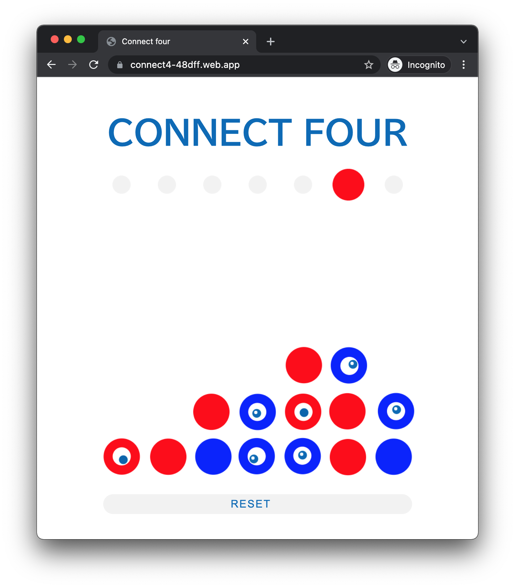

# Connect4

Connect Four is a two-player connection board game, in which the players choose a color and then take turns dropping colored discs into a seven-column, six-row vertically suspended grid.
The objective of the game is to be the first to form a horizontal, vertical, or diagonal line of four of one's own discs.

demo: https://connect4-48dff.web.app/

## Implemented Features

- Victory judgment
- Smart Phone Support
- Animation
  - Eyeball movement
  - Disc movement
  - Loser's disc shattering

## Technology used

- firebase
- JavaScript
- HTML
- CSS

## Testing

- Unit tests
- Integration tests

## Reference sites

- [EmilianoCarrillo/Connect4_Canvas](https://github.com/EmilianoCarrillo/Connect4_Canvas)
- [さわれる いのちの輝きくん](https://www.shapoco.net/inochi/)
